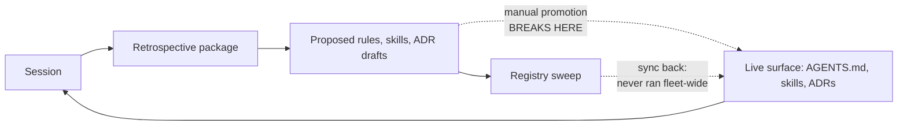

# COE survey — eight repos, 2026-07-02

**What this is.** Roadmap step 0 from [README.md](./README.md): a survey of the
eight active AI-partnered repos, a ranked friction list, the conventions that
earned their place, and a suggested scope for COE v0.1. Per-repo detail lives
in [survey-2026-07-02-repo-profiles.md](./survey-2026-07-02-repo-profiles.md);
this file is the synthesis.

**Repos surveyed:** agent-os, ai-skills, ai-utils, conference-summaries,
k8s-platform, policy-engine, software-factory, software-factory-prototype.

---

## The headline finding

You don't need to invent a standard — a de-facto one already exists across
these repos (pointer-style CLAUDE.md → AGENTS.md, dated retrospective
packages, numbered ADRs, skills with a fixed shape). What's missing is not
convention; it's **distribution and enforcement**. Two facts from the survey
dominate everything else:

1. **Every convention held by a mechanical check held; every convention held
   by prose or memory drifted.** This is not just k8s-platform's forensic
   conclusion ("bug classes covered by a blocking hook or fail-closed gate
   show zero recurrence; behaviors covered only by prose recurred for the
   life of the project") — the survey reproduced it *structurally* across all
   eight repos. Unchecked: stale self-descriptions, stranded rule proposals,
   diverged skill copies, root sprawl. Checked (k8s-platform's root
   allowlist, ADR-numbering, version-pin lints; ai-skills' canonical-JSON
   idempotence): held.

2. **The fleet's two most developed repos embody contradictory conclusions
   about the same mechanism.** ai-skills is built around assembling AGENTS.md
   from swept per-rule fragments. k8s-platform ran that exact pipeline for
   six weeks, measured it (152 rule candidates → 51 adopted → the top failure
   modes recurred anyway), and retired it in favor of "write the check, not
   the rule." COE v0.1 has to pick a side — see the decision point below.

Everything else in this survey is detail supporting those two facts.

## The eight repos at a glance

| Repo | What it is | Entry chain (lines) | Skills | CI / hooks | Retros |
|---|---|---|---|---|---|
| software-factory | dark-factory research + architecture corpus | CLAUDE (5) → AGENTS (206) → AGENT-ENTRY (150) | 24 | 5 workflows, 2 hooks | 57 |
| k8s-platform | ephemeral EKS demo platform (terraform/crossplane/argocd) | CLAUDE (8) → AGENTS (142, budget ≤150) → ai/LESSONS.md | 11 (+10 archived) | 10 workflows, ~90 lints, 3 hooks | 50 |
| agent-os | architecture-of-record for an agent runtime | AGENTS (53) only | 11 | none | 4 |
| ai-skills | cross-repo registry for skills/rules/ADRs | README → AGENTS (73, generated) | 2 (+19 registry copies) | 5 workflows | 3 |
| policy-engine | policy-platform spec/plan corpus (prose only) | none — INDEX.md (297) | 6 | none | 2 |
| conference-summaries | conference-data extraction (pre-implementation) | CLAUDE (4, tombstone) → AGENTS (82) | 6 | none | 0 |
| sf-prototype | dockerized Gas City deployment (running code) | CLAUDE (12) → AGENTS (61) → docs/HANDOFF §3 | 0 | 1 hook, local `make test` | 0 |
| ai-utils | seed ideas + this COE effort | README (3) | 0 | none | 0 |

Reading the table columns against each other: the three repos with *any*
mechanical enforcement (k8s-platform, software-factory, ai-skills) are also
the three whose conventions are most intact. The five with none run entirely
on convention — and every one of them shows the drift symptoms below.

## Where the same thing lives under eight different names

Each row is one document class every repo needs. The variant count is the
finding: an agent (or you) re-learns these locations on every repo switch.

| Document class | Variants found |
|---|---|
| Agent entry point | `AGENTS.md` alone · `CLAUDE.md`→`AGENTS.md` pointer (4 wordings) · `INDEX.md` with no AGENTS.md · bare README |
| Deep-dive navigation | `AGENT-ENTRY.md` (software-factory) · header-gated `ai-guidance/` (conference-summaries) · `INDEX.md` per-doc "when to consult" (policy-engine) · none |
| Session handoff | `ai/handoff.md` (91 KB) · `_meta/HANDOFF.md` (3 sessions stacked) · `spec-plan/HANDOFF.md` · `docs/HANDOFF.md` · 13 × `SESSION-HANDOFF-*.md` |
| Decisions (ADRs) | `adr/NNNN-*.md` · `docs/adr/NNNN-*.md` · `docs/decisions/NNNN-*.md` · `adrs/<kebab>.md` (no numbers) · retro Part-4 titles never authored |
| Decisions (other) | root `decisions/` (scope envelopes, not ADRs) · `DECISIONS.md` · `decision-journal.md` · `_meta/reviews/` (4 overlapping files) |
| Retrospectives | `retrospective/YYYY-MM-DD-PPP.md` + sibling dir — **the one convention 6 of 8 repos share** (3 generations of internal format) |
| Environment facts | `ai/environment.md` (k8s-platform only) · scattered in AGENTS.md/HANDOFF elsewhere |
| Scratch / temp | `temp/` gitignored (with one tracked file anyway) · nothing declared elsewhere |
| Session residue | 15 grandfathered root files (k8s-platform) · root `overnight-summary.md` + `PR-N-` archive prefix (software-factory) · none |

## Ranked friction list

Ranked by cost: how much re-learning, re-derivation, or silent wrongness each
one produces per session, times how many repos it touches.

### 1. The learning loop is broken at the promotion step, fleet-wide

Every repo runs the same loop: session → retrospective → proposed rules /
skills / ADR drafts → *promotion into the live instruction surface*. The last
leg is manual everywhere, and it has failed everywhere, in escalating ways:

- **policy-engine:** two retros proposed 18 rules addressed to "AGENTS.md at
  the repo root" — *the repo has no AGENTS.md*. Sessions re-derive the same
  rules ("write the master index before fan-out" was proposed twice, a month
  apart) because there's no merged file to check against.
- **agent-os:** ~28 rules proposed across 4 retros; 6 promoted. Three
  proposed skills were never built and sit indistinguishable from the ones
  that were.
- **software-factory:** 181 per-rule artifacts produced; ~30 adopted. No
  visible tracking of live vs. pending.
- **ai-skills (the registry itself):** its generated AGENTS.md renders 13 of
  51 live rules — the flagship regeneration was never re-run after the big
  sweep. Three rules were hand-landed bypassing its own pipeline.
- **k8s-platform:** promoted aggressively (51 rules), measured the result —
  target behaviors didn't change — and concluded the channel itself was the
  problem.

Why it ranks first: the retros are consistently excellent (k8s-platform's
forensics called retrospective honesty "the project's single best asset"),
so the fleet pays full price for harvesting knowledge and then loses most of
it in transit.

### 2. Skill distribution is copy-paste, so drift is structural

The same skills are installed in up to five repos by hand-copying, and the
registry designed to fix this doesn't cover the fleet:

- `self-retrospective` exists in **three generations simultaneously**: 530
  lines (conference-summaries, policy-engine), 1355 lines (agent-os,
  software-factory, and the registry copy), 1401 lines (k8s-platform — which
  amended it on evidence to stop emitting per-rule files). The amendment
  never propagated; two repos still run the process a third repo proved out
  and retired, and the registry serves the pre-amendment version.
- The registry sweep config tracks **2 of 8 repos** (itself and
  software-factory). Distribution to the others has been manual ("copy
  factory skills" PRs, "from software-factory" commits).
- The registry's folded-in copy of *its own tooling* has diverged from its
  live copy — a subscriber would receive an outdated skill-registry.
- conference-summaries' imported skills still cite another repo's branches
  and assume a `retrospective/` dir and CI that don't exist there.

The design is sound (content-addressed ledgers, semantic-diff review,
hard-stop invariants). What's missing is coverage and a drift gate — the
registry currently relies on a human remembering to run sweep and sync.

### 3. Where there is no check, the artifact lies

Recurring shape: a file that *describes* state drifts from the state, and
nothing notices. This is what makes agents confidently wrong at session start.

- software-factory's failure-modes CI gate watches `architectures/0N-*.md`
  and `architectures/failure-modes.md` — **neither exists anymore**. The gate
  has been green and dormant since the corpus moved to a different naming
  scheme.
- ai-skills: 3 of 4 ledger renders stale (skills ledger shows 5 of 21
  entries); generated AGENTS.md stale by ~41 rules.
- conference-summaries: AGENTS.md's own "repository structure" block omits 4
  of the directories that exist, and two progress docs point at files that
  moved or never existed.
- policy-engine: four documents self-report the corpus size four different
  ways; a superseded schema spec is still in place next to its replacement.
- software-factory: `CONTEXT-SLIMMING-PLAN.md` still says "Plan, not
  implemented" — it was implemented (`AGENT-ENTRY.md` exists and follows it).
- k8s-platform's counterexamples prove the mechanism: root allowlist, ADR
  numbering, account-ID, version-pin-pairing lints — the covered classes
  stopped recurring.

### 4. Eight repos, six entry contracts

An agent landing in a repo must discover *how to orient* before it can
orient. The chains range from excellent to absent: software-factory's
three-file chain with task-aware reading lists; k8s-platform's budgeted
operating agreement; conference-summaries' tombstone CLAUDE.md;
policy-engine's no-README, no-AGENTS.md, three competing indexes; ai-utils'
three-line README. The CLAUDE.md→AGENTS.md pointer alone has four wordings.
None of this is checked, so even the good chains rot (see friction 3).

### 5. One document class, many homes (and root-level residue)

The variants table above is the evidence. Two aggravations:

- **Root sprawl as session residue:** 15 grandfathered run-summaries and
  envelopes at k8s-platform's root (its own forensics: "16 ephemeral session
  artifacts… contradictory belief states" — now linted, not yet relocated);
  software-factory's root mixes the live overnight-summary with three
  overlapping forward-looking docs.
- **"Decisions" means three different things** at k8s-platform alone (ADRs
  in `docs/decisions/`, autonomous-run envelopes in root `decisions/`, and
  skills that reference a `docs/adr/` that doesn't exist there).

### 6. Handoffs and instruction files grow without bound

No document class has a size or rotation rule outside k8s-platform's AGENTS
budget. Observed: `ai/handoff.md` at 91 KB and `docs/open-issues.md` at 90 KB
(k8s-platform); three sessions stacked in one HANDOFF (agent-os); 13
sequential SESSION-HANDOFF files with the active one tracked only in prose
(software-factory); a 1355-line skill whose per-session description load the
k8s-platform forensics explicitly costed (15.2K tokens minimum per session
before its restructure, target ≤8K after). Instruction surface is a real
per-session cost and only one repo budgets it.

### 7. Environment facts are rediscovered per session

Only k8s-platform has a declared capability-facts file (`ai/environment.md`,
born from forensics: "capability gaps spawn workaround layers; document the
capability profile in ONE place"). software-factory-prototype's equivalent —
the sandbox build recipe — is deliberately *uncommitted* prose re-created
from HANDOFF §3 each session. The COE notes' "sandbox manifest" idea is
exactly this gap; nothing implements it yet.

### 8. Small hygiene frictions that break tooling

Individually minor, all instantly lintable: filenames with spaces (5 root
docs in policy-engine — they broke this survey's own shell globs); versions
baked into filenames (`spec v1.md`, `C2-v1.0-rc-RECONCILED.md` — the corpus
documents the "is C2 frozen?" confusion this caused); stock 219-line Python
.gitignore in two repos with zero Python; a hardcoded Windows path in
committed config; a tracked file inside a gitignored `temp/`.

## What earned its place

Conventions that survived contact with real work, with the repo that proved
them. These are the raw material for the v0.1 template — already tried, per
the "standard follows practice" rule in the COE README.

| Theme | Convention (provenance) |
|---|---|
| Entry | CLAUDE.md as a ≤10-line pointer to AGENTS.md; single source of truth (4 repos). Prototype's twist: the pointer also carries the one most load-bearing environment fact inline. |
| Entry | AGENTS.md as a **budgeted operating agreement** — ≤150 lines, judgment rules only, "mechanical rules are enforced, not memorized" (k8s-platform). |
| Entry | Progressive disclosure for big corpora: an entry doc that *names* what each sub-doc contains, never restates conclusions, plus task-aware reading lists (software-factory); header-gated "WHEN TO READ THIS" blocks on deep docs (conference-summaries); per-doc "when to consult" index entries (policy-engine). |
| Memory | Retrospective package: `retrospective/YYYY-MM-DD-PPP.md` + sibling artifact dir with durable hash-ID filenames (6 repos; software-factory/k8s-platform most mature). |
| Memory | The remedy-decision protocol: classify every lesson as *mechanical check > one budgeted AGENTS.md line > structural proposal > observation only* (k8s-platform — the empirically-backed doctrine). |
| Memory | ADRs: `NNNN-kebab-title.md`, fixed Context→Decision→Alternatives→Consequences→References order, relative links (agent-os is the reference implementation; 74 in software-factory). |
| Memory | Session handoff as a fixed-skeleton pickup brief: what's true now / how to build here / next action (prototype's `docs/HANDOFF.md` is the cleanest; k8s-platform's "facts + next action only" rule keeps it honest). |
| Enforcement | Root-file allowlist lint; audit-before-enforce (new checks scan every existing path and land green in the same PR); verify-then-PR mirror gates for heavy dispatch-only CI (k8s-platform). |
| Enforcement | Generated-file pattern: JSON source → rendered markdown, `[skip ci]` self-commit, byte-idempotent canonical dumper (ai-skills ledgers; software-factory sources.md). |
| Enforcement | Self-installing skills: `install.py --check`/`--force` on every invocation wires PreToolUse hard gates into settings.json, so governance doesn't depend on the agent remembering (software-factory). Advisory-gate variant: CI posts a dismissible REQUEST_CHANGES review instead of failing (software-factory). |
| Environment | Lifecycle hooks: SessionStart environment bring-up (prototype's dockerd starter; k8s-platform's toolchain install + stale-checkout warning); SessionEnd transcript capture into `logs/` — which quietly implements ai-utils' prompt-logging idea (k8s-platform). |
| Environment | `ai/environment.md` capability-facts file + `versions.env` single-source tool pins with a paired-pin lint (k8s-platform). |
| Orchestration | Frozen Canon before fan-out, `[PROPOSED — not in source]` markers for fabrication control, completeness verified from a manifest on disk rather than agent self-reports (agent-os). |
| Distribution | Registry machinery: per-type ledgers, content-addressed dedup with tombstones, semantic-diff as the review surface, hard-stop invariants on undrained state (ai-skills — sound design, needs coverage + automation). |
| Audience | Two-audience split: AI-dense canonical files vs. plain-language human tier, governed by an explicit skill (software-factory's plain-english docs + human-scoped-deliverables; k8s-platform's ai/LESSONS.md vs docs/lessons.md). |
| Budget | Skills earn their per-session load: admission rule (environment bridge / repeated domain loop / owner-valued interface), ≤12 active, archive the rest with a why-archived README, restore = one `git mv` (k8s-platform). |

## The decision COE v0.1 has to make

**Decision point: what is the retrospective→instruction pipeline allowed to
produce?** This is the ai-skills vs. k8s-platform contradiction, and the
standard can't hold both.

- **Option A — checks-first (k8s-platform doctrine).** Retros classify every
  proposed remedy: mechanical check first, a budgeted AGENTS.md line only for
  genuine judgment calls, structural proposals to you for incentive problems,
  otherwise record-and-do-nothing. Rules require a cited incident. AGENTS.md
  stays ≤150 lines.
- **Option B — rule-assembly (ai-skills design).** Retros emit per-rule
  fragment files; the registry sweeps, dedupes, and human-gates them; sync
  regenerates each repo's AGENTS.md from subscribed fragments.

Trade-off: B automates propagation but automates the channel the only
controlled evidence in the fleet says doesn't change behavior (51 adopted
rules, top failure modes recurred to the end; a rule violated minutes after
its author wrote it). A binds behavior but says nothing about how checks and
skills propagate across repos — which is B's actual strength.

**Recommendation (opinion, not synthesis):** adopt A as doctrine and keep
B's machinery with the payload changed — the registry distributes *skills,
checks (lints/hooks/workflows), and the small evidence-backed rule set*,
rather than assembling unbounded AGENTS.md files. The pipeline pieces
(ledgers, semantic diffs, dispositions) are payload-agnostic, so this is
cheap to rewind: if budgeted rules turn out to propagate badly, re-enable
fragment assembly for exactly the rules layer without rebuilding anything.

## Suggested scope for COE v0.1

The README's iteration rule: only the highest-friction items, tried by hand
on one or two repos before anything is automated. Frictions 1–5 point at
three items:

**1. One entry contract (fixes frictions 4 and 6).** Every conforming repo
has exactly: `README.md` (humans), `AGENTS.md` (agents; hard line budget;
judgment rules only), `CLAUDE.md` (fixed ≤10-line pointer text). Big corpora
may add one navigation doc in the AGENT-ENTRY style; every deep doc opens
with a when-to-read header. Nothing else at root speaks for the repo.

**2. One home per document class (fixes friction 5, most of 8).** A short
table in the spec, drawn from the winners above — proposed: `docs/adr/` for
ADRs, `retrospective/` as-is, `ai/handoff.md` (facts + next action only),
`ai/environment.md`, `archive/` for frozen history, `temp/` gitignored for
scratch, session residue never at root. Adopting a repo means moving files
once; the point is that the *next* eight repos don't re-decide this.

**3. Conformance checks shipped with the spec (fixes friction 3; keeps 1, 2,
5 fixed).** v0.1 is one script + one workflow, warnings-first, with every
check traceable to an observed failure in this survey: entry files present
and within budget; root allowlist; filename hygiene (no spaces); .gitignore
matches repo contents; generated files fresh (where declared); installed
skills match their registry version or are explicitly marked local. The
k8s-platform lints are the reference implementations to copy, and
audit-before-enforce is the landing rule.

Plus the two standing decisions that make the above stick: the decision
point above (recommend A), and expanding the registry sweep to the whole
fleet with a two-way drift gate — the survey's clearest single automation
win, since the machinery already exists and every observed failure was "a
human didn't re-run it."

Explicitly deferred (matching the README roadmap): sandbox manifest and
devcontainer generation (friction 7 — but v0.1 should at least *name*
`ai/environment.md` as the future home), knowledge-base distillation,
retrospection automation beyond what the existing skill does.

## What the survey answers among the README's open questions

- **Vendor coupling:** practice already split it — AGENTS.md carries the
  contract; `.claude/` carries the adapter (hooks, skills, settings). Keep
  that line.
- **Knowledge-base writes:** every repo that works routes agent learning
  through PRs (retros are committed, promotion is human-gated). The registry
  formalizes the review surface. Direct agent writes to instruction files
  appear nowhere and the one generated-AGENTS.md experiment is the stalest
  artifact in the fleet.
- **Enforcement strictness:** warnings first is not just politeness — the
  dormant software-factory gate shows a *failing-closed but mistargeted*
  check is worse than none, because it certifies the wrong thing. Checks
  graduate to blocking after surviving a few iterations, exactly as the
  README proposed.
- **Scope (per-repo vs. org layer):** still open, but the survey sharpens
  it: the org layer that matters first is the registry (distribution), not
  shared settings.
- **Secrets provisioning:** untouched by this survey; genuinely open.

---

*Method note: structure, file counts, and skill checksums were verified
directly on disk in all eight repos on 2026-07-02 (branch state as cloned).
Behavioral claims — what recurred, what stopped — come from the repos' own
retrospectives and k8s-platform's forensics corpus, not from independent
re-measurement. Detailed per-repo evidence: see the companion profiles file.*
