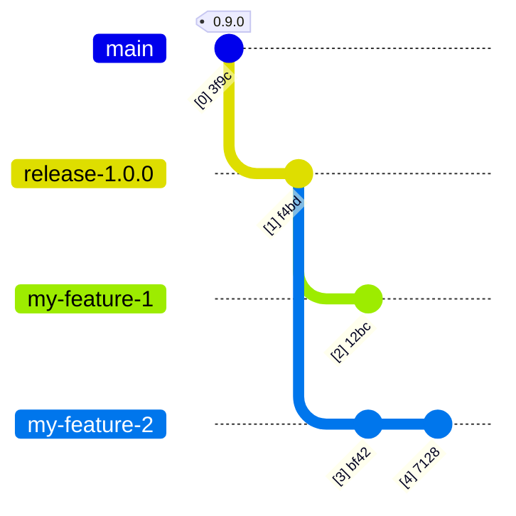
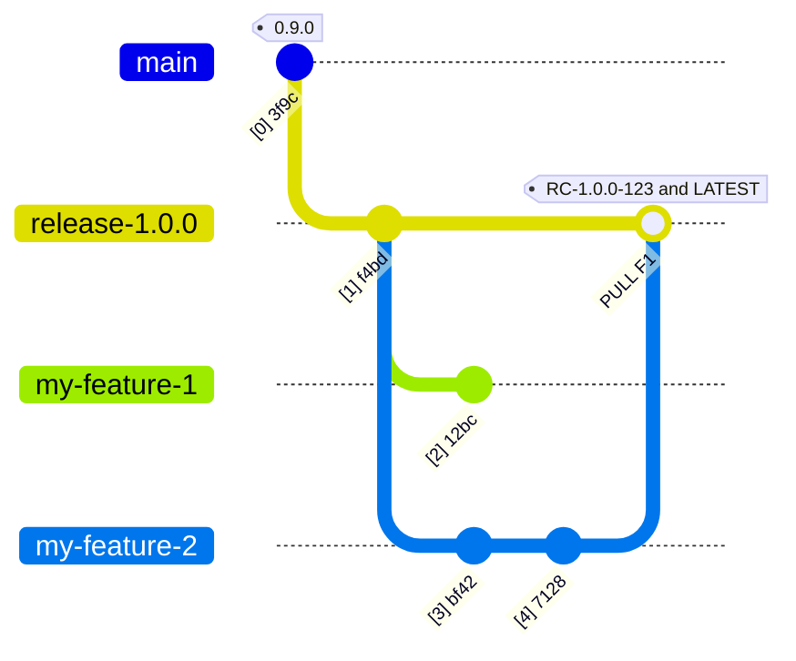
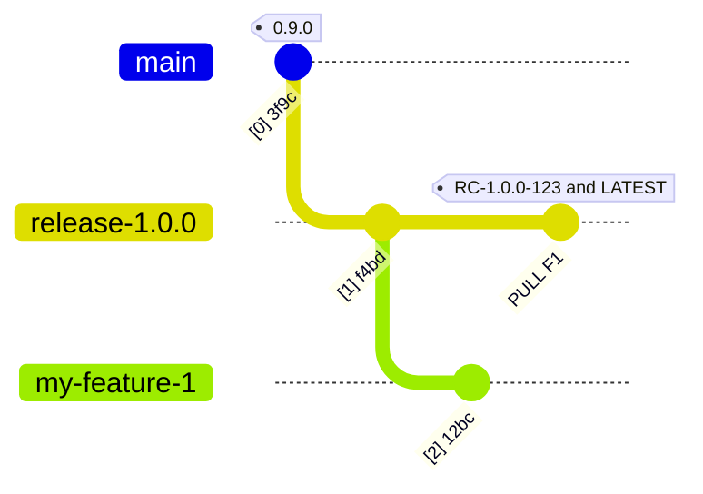
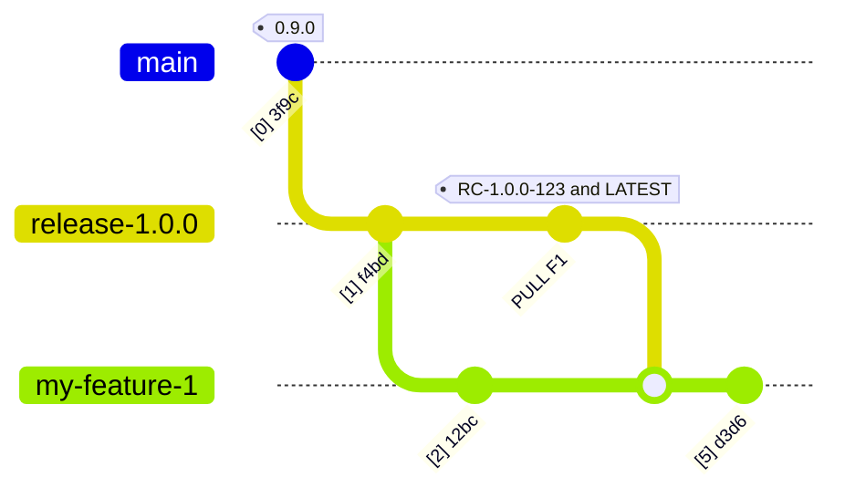
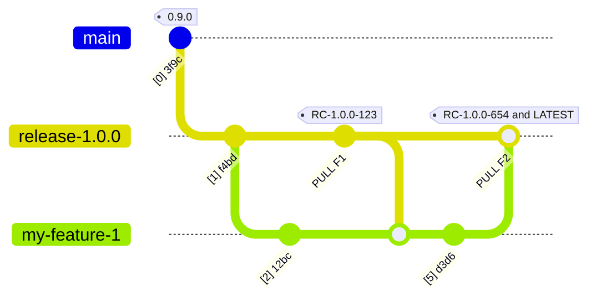
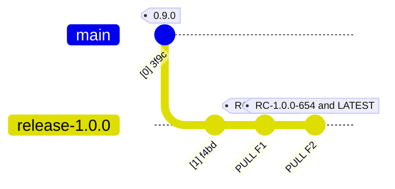
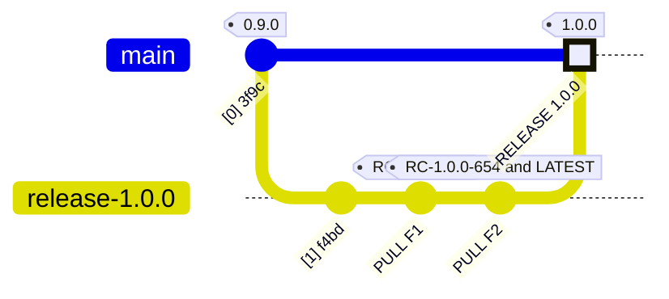
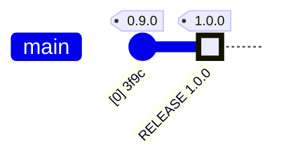
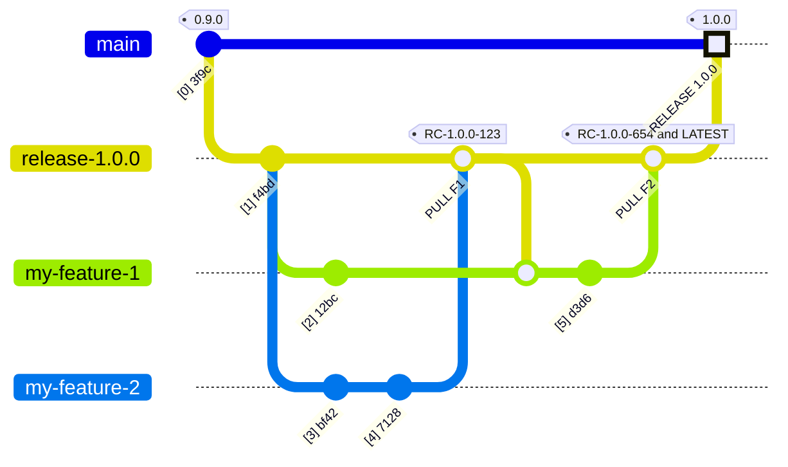

# Deprecated
**Please see [chiller-doc/cicd_overview.md](https://github.com/lago-morph/chiller-doc/blob/main/cicd_overview.md).  This page is no longer maintained.**

***

# Overview
Automated CI/CD will be handled by using GitHub Actions.  We will handle:
- Continuous integration (check that automated unit and integration tests are successful)
- Continuous delivery (build artifacts ready for deployment and make them available in a central location)
- Continuous deployment (automatically deploy new releases into production, on-demand creation and tear-down of private production-like versions of the application)
When necessary I will distinguish between the two Ds by specifying CI/CD(elivery) or CI/CD(eployment).

The actions are described in a [different wiki page](https://github.com/lago-morph/chiller/wiki/CI-CD-Github-Actions-design).

## Branches
There are three types of branches:
- main - single protected branch for code deployed to production.  Can only be modified by pull requests and their associated github actions.
- release-a.b.c - protected branch for a planned upcoming release.  Can only be modified with pull request which triggers CI/CD(elivery) process for code to be merged
- feature releases - anything not named main or release-* - ephemeral, deleted after merging

## CI/CD triggers
A pull request into a release-a.b.c branch triggers the CI/CD(elivery) cycle.  Any pull request into main must come from a release-* branch and will trigger the CI/CD(eployment) cycle.

## Components
The overall system consists of the following components:
- Back-end api services
- Front end user interface
- Helm chart for deploying application
  - parameterized for system test-new, system test-upgrade, load test, production-new, and production-upgrade
- Terraform script for creating environment
  - parameterized for system test, load test, and production

Each component includes automated tests.  At a minimum this includes unit tests, integration tests, and system tests.  These automated tests might include test scripts, test data, for the load test additional software and/or helm charts for simulating load, for production upgrade an automated process for monitoring the upgrade and metrics for determining if an upgrade is successful or needs to be immediately rolled back.

# Example
We start by creating branch release-1.0.0 from main.  We update the readme and some other files, and commit it as a starting point for development.  We actually do this by creating a feature release, a pull request, and approve the pull request.  That will trigger builds for containers, helm charts, and terraform scripts that come from main, which will be available now if we want to trigger deployment or system test environments in our release branch.  Those on-demand system test and deployment test features will only be available after the first pull request is approved into the release branch.

## Development commences
Two different developers are working on features for this release.  Then branch off the release branch, and start making changes

## Feature merged into release branch
One of the developers finishes their feature, and issues a pull request into the release branch.  This triggers the CI process through integration testing and package/container creation.  If those checks are good, and the pull request is approved, it is merged into the release branch and the feature branch is deleted.  The CD artifacts are then published with the tags assigned to this merge, including a "latest" tag.

When the pull request is created, it will will run the CI/CD(elivery) actions.  The pull request cannot be approved until the CI/CD run is successful.  At the end of a successful run the containers will be uploaded to ghcr.io, and tagged with the commit hash, in this case `7128`.  If the tag is changed in the pull request (e.g., fixing something requested during the discussion), the CI/CD run goes again.  If the pull request is approved, it will tag the images created during the CI/CD run with both the `RC-1.0.0-123` and `RC-1.0.0-LATEST` tags.  Note that in this example `123` in the tag name is a shortcut for the real suffix, which will be in the form `YYYY-MM-DD.HH-MM-SS` and will be generated by the action triggered by pull request approval.

## The my-feature-2 branch is now deleted

## On-demand deployment testing
At any time, a github action can be triggered to do deployment testing (into brand new environment, install past version then upgrade, brand new with load testing).  The action will use the `RC-1.0.0-LATEST` tag on containers to do deployment testing.  If the tests are successful the environment is deleted after the test.  If one of the tests is not successful, an issue is created and the environment is left deployed so that the problem can be debugged.  If the issue associated with a failed test is closed, the environment is automatically deleted.

## On-demand system test environment
At any time, a github action can be triggered to deploy into a new system test environment with containers tagged `RC-1.0.0-LATEST`.  If the deployment fails, an issue is created and the deployment is left as-is.  If the deployment succeeds, an issue is still created, saying that the environment is ready to use.  When the issue associated with a test environment is closed, the environment is automatically deleted.

## Continued development
If needed, the other developer merges the updated release branch into their feature branch and continues working.

## Second feature merged
The process repeats for the other feature.  A pull request is started, the CI/CD(elivery) process runs, and if the PR is approved, it is merged.  CD artifacts are then released, and the new artifacts take over the tag `RC-1.0.0-LATEST` on the branch.

## The feature-1 branch can now be deleted

## Pull request into main
A pull request is created into main using the tag for a release candidate.  This triggers CI/CD(eployment) tests (into new environment, install previous version then upgrade, brand new with load testing) which must pass before the pull request can be approved.  As with the on-demand CI/CD(eployment) tests, the environments are deleted if the test is successful, and is retained (with a new issue created) when they fail.  The failed environments are automatically deleted when the issue related to the failed deployment is closed.

## The release is finalized
The pull request into main is approved, triggering automatic deployment into production.  If the automatic deployment fails, it is rolled back, an issue is created, and the merge is rolled back.  If automatic deployment succeeds, the merge is tagged as the release number and the release branch is deleted.

## The release-1.0.0 branch can now be deleted

## Full process with all branches

Note - moved actions to another document
