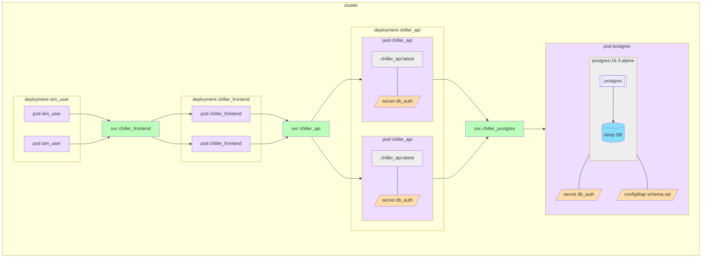
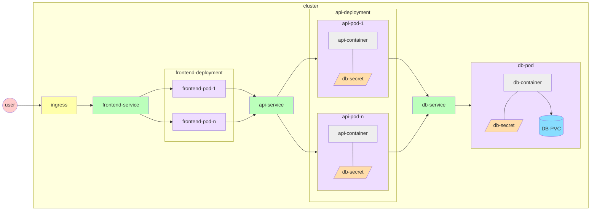

# Testing configuration

Internal images are tagged by the commit hash (if generated on-demand) or the RC version tag (if generated as part of a pull request to main).

## Deployments

### chiller_frontend
- replicas: 2
- image: chiller_frontend

### chiller_api
- replicas: 2
- image: chiller_api

### sim_user
- replicas: 2+
- image: sim_user

## Pods

### postgres
- image: postgres:16.3-alpine
- secret: db_auth

The database is in a single pod.  For testing, the database files are ephemeral and located inside the container image.  The secret is for the username and password to access the database.

## Services

### chiller_frontend
Exposes chiller_frontend deployment

### chiller_api
Exposes chiller_api deployment

### postgres
Exposes postgres pod

## Secrets

### db_auth
- PGUSER: postgres
- PGPASSWORD: random alphanumeric string 24 characters

# Production configuration

WORK IN PROGRESS

