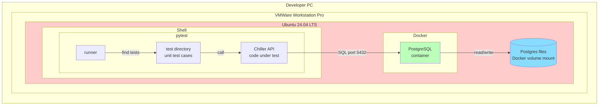
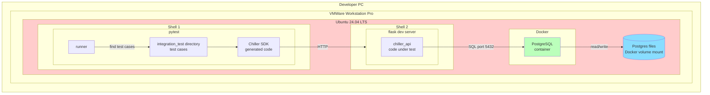
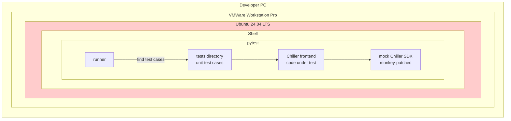

# Chiller API unit test

```mermaid
flowchart LR
  classDef containerClass fill:#bfb
  classDef dbClass fill:#8df
  classDef userClass fill:#fcc
  classDef ingressClass fill:#ffa
  subgraph devpc["Developer PC"]
    subgraph vmware["VMWare Workstation Pro"]
      subgraph ubuntu["Ubuntu 24.04 LTS"]
        direction LR
        db[("`Postgres files
              Docker volume mount`")]:::dbClass
        subgraph docker["Docker"]
          pgcontainer["`PostgreSQL 
                        container`"]:::containerClass
        end
        subgraph shell1["Shell"]
          subgraph python["pytest"]
              pytest["runner"] -- find tests --> capi_unit["`test directory
                                                                            unit test cases`"] -- call --> chiller_api["`Chiller API 
                                                                                                                                  code under test`"]
          end
        end
      end
    end
  end
  class ubuntu userClass
  pgcontainer -- read/write --> db
  chiller_api -- SQL port 5432 --> pgcontainer
```

# Chiller API integration test

```mermaid
flowchart LR
  classDef containerClass fill:#bfb
  classDef dbClass fill:#8df
  classDef userClass fill:#fcc
  classDef ingressClass fill:#ffa
  subgraph devpc["Developer PC"]
    subgraph vmware["VMWare Workstation Pro"]
      subgraph ubuntu["Ubuntu 24.04 LTS"]
        direction LR
        db[("`Postgres files
              Docker volume mount`")]:::dbClass
        subgraph docker["Docker"]
          pgcontainer["`PostgreSQL 
                        container`"]:::containerClass
        end
        subgraph shell1["Shell 1"]
          subgraph python1["pytest"]
              pytest["runner"] -- find test cases --> capi_unit["`integration_test directory
                                                                               test cases`"] --> chiller_sdk["`Chiller SDK 
                                                                                                                                  generated code`"]
          end
        end
        subgraph shell2["Shell 2"]
          subgraph flask["flask dev server"]
              chiller_api["`chiller_api 
                     code under test`"]
          end
        end
      end
    end
  end
  class ubuntu userClass
  pgcontainer -- read/write --> db
  chiller_sdk -- HTTP -->  flask
  chiller_api -- SQL port 5432 --> pgcontainer
```

# Chiller Frontend unit test

```mermaid
flowchart LR
  classDef containerClass fill:#bfb
  classDef dbClass fill:#8df
  classDef userClass fill:#fcc
  classDef ingressClass fill:#ffa
  subgraph devpc["Developer PC"]
    subgraph vmware["VMWare Workstation Pro"]
      subgraph ubuntu["Ubuntu 24.04 LTS"]
        direction LR
        subgraph shell1["Shell"]
          subgraph python1["pytest"]
              pytest["runner"] -- find test cases --> frontend_int["`tests directory
                                                                     unit test cases`"] --> chiller_fe["`Chiller frontend
                                                                                                code under test`"] 
              chiller_fe --> mt_sdk["`mock Chiller SDK
                                     monkey-patched`"]
          end
        end
      end
    end
  end
  class ubuntu userClass
```

# Chiller Frontend integration test

```mermaid
flowchart LR
  classDef containerClass fill:#bfb
  classDef dbClass fill:#8df
  classDef userClass fill:#fcc
  classDef ingressClass fill:#ffa
  subgraph devpc["Developer PC"]
    subgraph vmware["VMWare Workstation Pro"]
      subgraph ubuntu["Ubuntu 24.04 LTS"]
        direction LR
        db[("`Postgres files
              Docker volume mount`")]:::dbClass
        subgraph docker["Docker"]
          pgcontainer["`PostgreSQL 
                        container`"]:::containerClass
        end
        subgraph shell1["Shell 1"]
          subgraph python1["pytest"]
              pytest["runner"] -- find test cases --> 
                           frontend_int["`integration_tests directory
                                                      test cases`"] --> chiller_fe["`Chiller frontend
                                                                                      code under test`"] --> 
                                                                                                   chiller_sdk["`Chiller SDK 
                                                                                                                  generated code`"]
          end
        end
        subgraph shell2["Shell 2"]
          subgraph flask["flask dev server"]
              chiller_api["chiller_api"]
          end
        end
      end
    end
  end
  class ubuntu userClass
  pgcontainer -- read/write --> db
  chiller_sdk -- HTTP -->  flask
  chiller_api -- SQL port 5432 --> pgcontainer
```

# Chiller Frontend browser test

```mermaid
flowchart LR
  classDef containerClass fill:#bfb
  classDef dbClass fill:#8df
  classDef userClass fill:#fcc
  classDef ingressClass fill:#ffa
  subgraph devpc["Developer PC"]
    subgraph vmware["VMWare Workstation Pro"]
      subgraph ubuntu["Ubuntu 24.04 LTS"]
        direction LR
        db[("`Postgres files
              Docker volume mount`")]:::dbClass
        subgraph docker["Docker"]
          pgcontainer["`PostgreSQL 
                        container`"]:::containerClass
        end
        subgraph shell1["Shell 1"]
          subgraph python1["pytest"]
              pytest["runner"] -- find test cases --> frontend_br["`browser_tests directory
                                                                     selenium test cases`"] --> chrome["chromium driver"]
          end
        end
        subgraph shell2["Shell 2"]
          subgraph flask_fe["flask dev server"]
              chiller_fe["`chiller_frontend 
                     code under test`"] --> chiller_sdk["`Chiller SDK 
                                                         generated code`"]
          end
        end
        subgraph shell3["Shell 3"]
          subgraph flask_api["flask dev server"]
              chiller_api["chiller_api"]
          end
        end
      end
    end
  end
  class ubuntu userClass
  pgcontainer -- read/write --> db
  chrome -- HTTP --> flask_fe
  chiller_sdk -- HTTP -->  flask_api
  chiller_api -- SQL port 5432 --> pgcontainer
```
