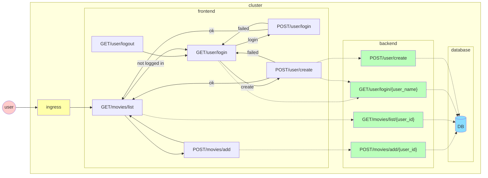

# Deprecated
**Please see [chiller-doc/application.md](https://github.com/lago-morph/chiller-doc/blob/main/application.md).  This page is no longer maintained.**

***

This will be a living document.  The idea is to initially have a very minimal application.  Until M is able to spend more time on this, the application will be written in Python using Flask.

## Application structure

The application is broken into three tiers.  A web front end tier that renders html pages, a middleware tier with microservices defined by the API, and a data storage layer.

Note that this is a "toy" application.  We allow anyone to create a user and don't have passwords.  Later we will add OAuth for authentication.

## Web site routes

- GET / redirects to GET /movies/list
- GET /movies/list will show the movie list of the logged in user.  If no user is logged in, will redirect to GET /user
- GET /user/login displays a form for the user name and login (POST /user/login) and create (POST /user/create) buttons.
- POST /user/login attempts to log in as the given user.  It is an error to try to log in as a user that does not exist, or with a username that is improperly formatted.  If the login is successful, set up the session information and redirect to / (which then redirects to the default place for logged in users).  If there is an error, GET /user/login with the error displayed.
- POST /user/create attempts to create the given user.  It is an error to try to create a user that already exists, or to use invalid formatting for the name.  If the create is successful, it will perform the authentication actions identical to POST /user/login, and will redirect to / (which will then redirect somewhere else).  If there is an error, GET /user/login with the error.
- GET /user/logout will log out the current user by destroying the user session and redirect to GET /user

## backend API
Note, there is overlap between the routes on the website and the API paths.  These are NOT the same thing.  The API will not be accessible from the outside, only from inside the application runtime environment.  

### User
- GET /user/login/{user_name}.  Will attempt to log in with the given credentials and return a user session token that embeds the user JSON object.  Initially, credentials are only a user name with alphabetic and numeric characters (no password)
- POST /user/create will create login if the name is not already taken.  Input is JSON user document with name filled in.  Creating a user consists of providing a valid user name (alphabetic and numeric characters)

### Movies
- GET /movies/list/{user_id} - will show a list of a user's movies.
- POST /movies/add/{user_id} - POST will add a movie to the given user's list.  Movie name can be string of any ASCII printable characters.  Note that movie names do not need to be unique (there is no separate movie table in the data store)

### Diagram

## Data storage
Users and movie lists are stored in a (TBD - maybe .ini file, maybe SQLite db, maybe redis, maybe MySQL)
